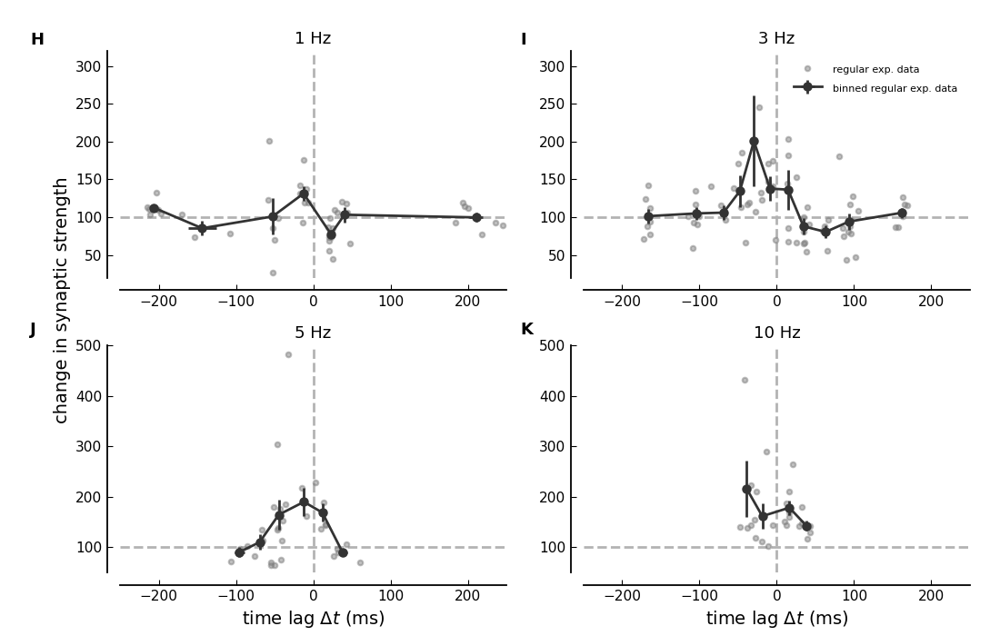
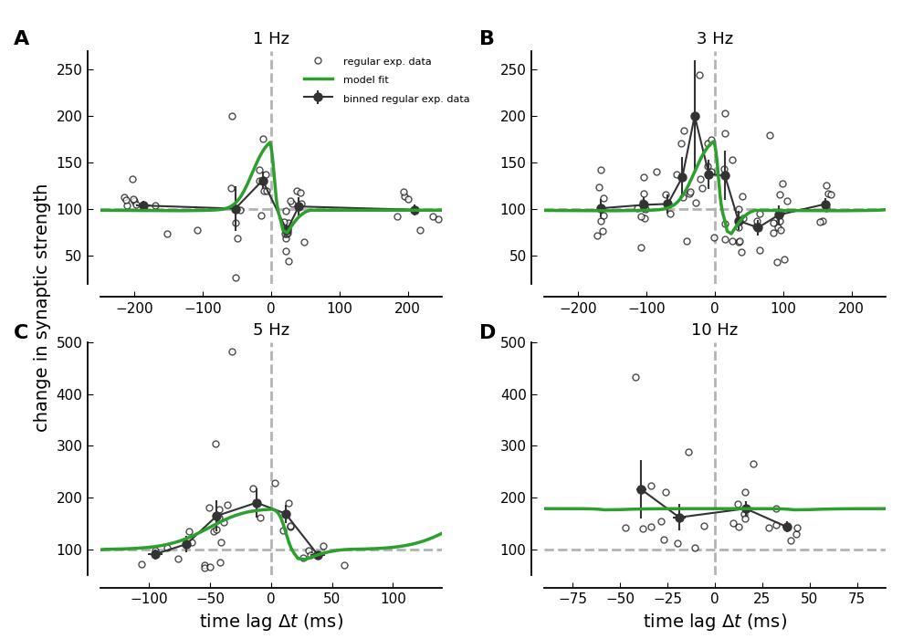
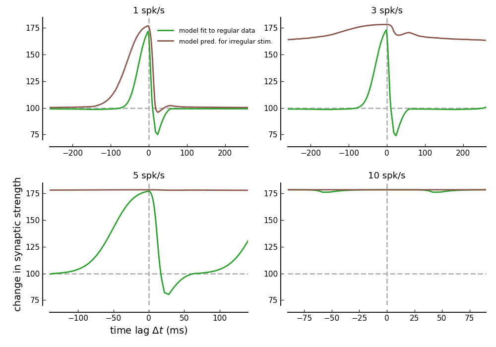
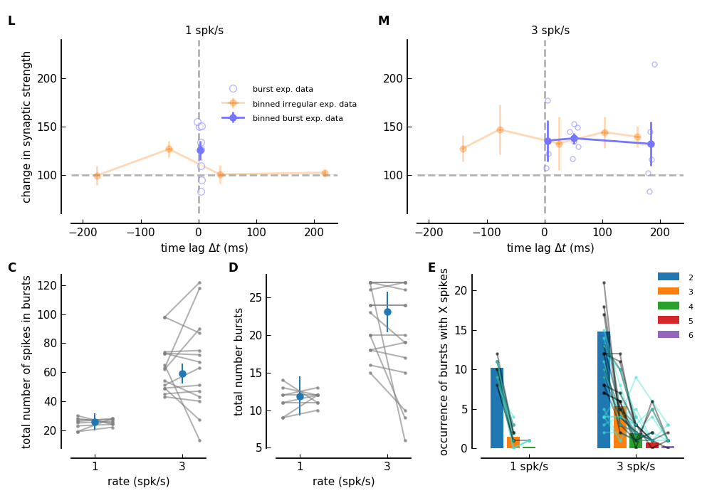
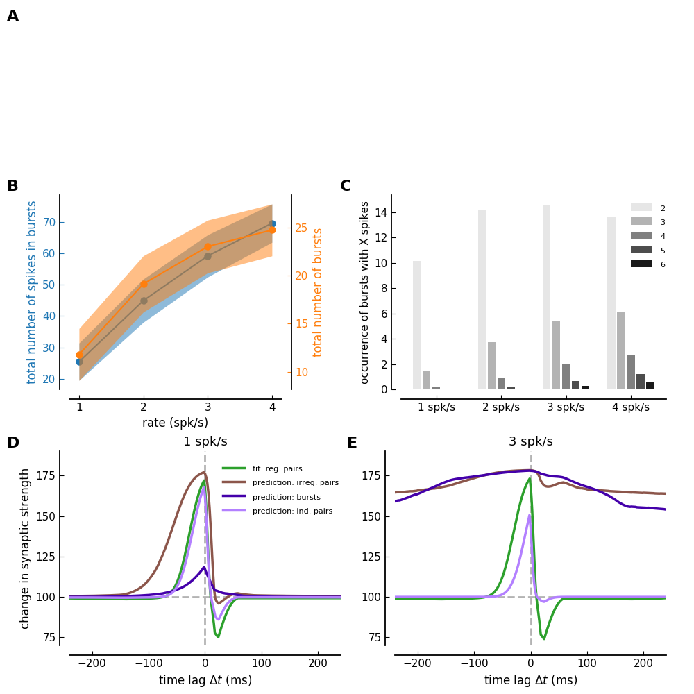
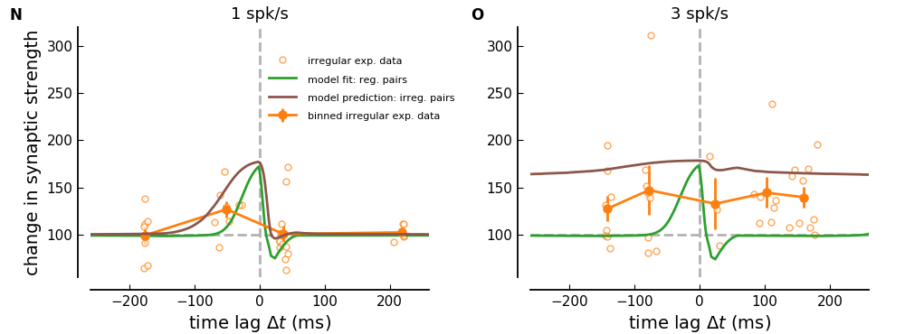

Calcium-based plasticity model and irregular, bursty activity patterns
==============================

Synaptic plasticity—the activity-dependent change in the strength of connections between neurons—is widely believed to underlie learning and memory. It is sensitive not only to the rate of neuronal firing but also to the precise timing of presynaptic and postsynaptic spikes. In experimental settings, plasticity is often studied using regular stimulation patterns, where action potentials are evenly spaced and spike timing is fixed. However, such artificial differs from the irregular and bursty firing patterns observed _in vivo_. In this repository, we investigate how more naturalistic firing patterns influence synaptic plasticity.

The Python code provided here implements the calculations for synaptic strength changes induced by irregular spike pairs. For related implementations and other publications of the calcium-based plasticity model, see [this repository](https://github.com/mgraupe/CalciumBasedPlasticityModel).

These scripts are associated with the following manuscript, currently submitted for publication:

**Yulia Dembitskaya, Silvana Valtcheva, Yihui Cui, Zhiwei Zheng, Srdjan Ostojic, Michael Graupner, and Laurent Venance (2026).** _Irregular and bursty neuronal firing extend spike-timing dependent plasticity window to behavioral timescales._

## Features
- The code implements the fit of the calcium-based plasticity model to experimental data obtained with regular spike-pair stimulation protocol. 
- It then uses the obtained parameter set to predict plasticity results for irregular spike-pairs and burts. 
- Includes scripts for reproducing figures from the associated manuscript

## Scripts

The below list describes the individual scripts and their purpose. 

### [`calcium_model_fit.py`](calcium_model_fit.py)
_Parameter fitting script_

Fits the calcium-based plasticity model to the experimental of 1, 3, 5 and 10 Hz regular spike-pair stimulation. 

**Input:** Experimental data for the four stimulation protocols (in [experimental_data](experimental_data/) 

**Output:** Saves solutions in the pickled [`solutions.p`](solutions.p) file

### [`checkOutcomes.py`](checkOutcomes.py)    
_Plotting model output_

Generates figures from regular and irregular spike-pair stimulatoin containing regular exp. data and mdoel fit/predictions                                              

**Input:** The paramter sets for which the figure is generated is specified in the script. Note that the publicaiton is based on the parameter set named `VenancesBin0`

**Output:** PDF/PNG matplotlib figures for [regular](FigsSimResults/regularDataFitVenance_VenancesBin0.pdf) and [irregular stim.](FigsSimResults/regular-irregular-DataFitVenance_VenancesBin0.pdf) 

### [`fig_regularPlasticityData.py`](fig_regularPlasticityData.py)

_Experimental data of for regular spike-pair stimulation_

Reads and plots the experimental data for regular spike-pair data.  

**Input:** Experiemental data for 1, 3, 5, and 10 Hz spike-pair stimulation

**Output:** PDF/PNG Figure       

### [`fig_ModelFitToRegularData.py`](fig_ModelFitToRegularData.py)

_Computation and visualization of regular plasticity data_

Generates and plots the model fit to the regular spike-pair data.  Note that the model is fitted to the binned data (black points).

**Input:** Uses the fitted parameter set `VenancesBin0` 

**Output:** PDF/PNG           

### [`fig_ModelRegularIrregularFrequencies.py`](fig_ModelRegularIrregularFrequencies.py)  
_Computation and visualization of regular and irregular plasticity data_

Generates and plots the model prediction for irregular spike-pair data based the parameter set obtained from fitting regular spike-pair data 

**Input:** Uses the fitted parameter set `VenancesBin0`     

**Output:** PDF/PNG                                                                                                     

### [`fig_ModelAndDataBurstStim.py`](fig_ModelAndDataBurstStim.py)

_Experimental data for burst-only stimulation_

Reads and plots the experimental data for burst-only spike-pair data. 

**Input:** Experimental data

**Output:** PDF/PNG Figure        

### [`fig_ModelPredictionBurstsIndividual.py`](fig_ModelPredictionBurstsIndividual.py)

_Spike pattern and plasticity outcomes for burst stimulation from the model_

The burst-only protocol is run in simulation and the spiking pattern is analyzed in terms of number of spikes in burst and number of bursts. The plasticity outcome as predicted by the calcium-based model is simulated. 

**Input:** Uses the fitted parameter set `VenancesBin0` 

**Output:** PDF/PNG Figure        

### [`fig_ModelAndDataIrregularStim.py`](fig_ModelAndDataIrregularStim.py)

_Experimental data and model prediction for irregular spike-pair stimulation_

Generates and plots the model fit to regular data and the prediction for irregular spike-pairs for 1 and 3 spk/s stimulation protcols. 

**Input:** Uses the fitted parameter set `VenancesBin0` 

**Output:** PDF/PNG Figure        

## Requires

All scripts are running with **Python 3**.
Standard python packages such as **numpy**, **scipy**, **pylab**, **time**, **os**,  **sys** and **matplotlib** are required.

## License

This project is licensed under the [GNU General Public License v3.0](https://www.gnu.org/licenses/gpl-3.0).
Note that the software is provided "as is", without warranty of any kind, express or implied.
If you use the code or data, please cite us!.

